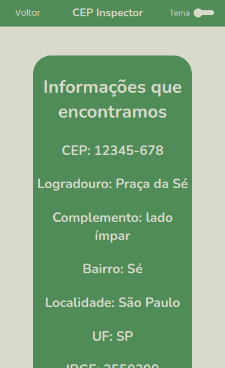

# CPF Inspector

## O objetivo do projeto é fazer com que a consulta de CEP seja algo simples e fácil!

<!-- ### Você já pode testar se quiser! Só clicar nesse link: [CPF Inspector](sem-link) -->

<hr>

### Veja como é:

<p align="center">
  
</p> 
<p align="center">
  
</p>

### Também em Dark Mode

<p align="center">
  
</p> 
<p align="center">
  
</p> 
<hr>

### Mobile

<p align="center" >
  
  _______
  
</p>

<hr>

## Como executar na sua máquina e testar

<br>

### **Instalando o projeto**

No terminal digite todos os comandos abaixo:

```Bash
git clone https://github.com/devzgabriel/CEP-Inspector.git
```

```Bash
cd CEP-Inspector
```

```Bash
yarn install
```

```Bash
yarn start
```

### **Executando testes**

Os testes serão acrescentados em breve!
